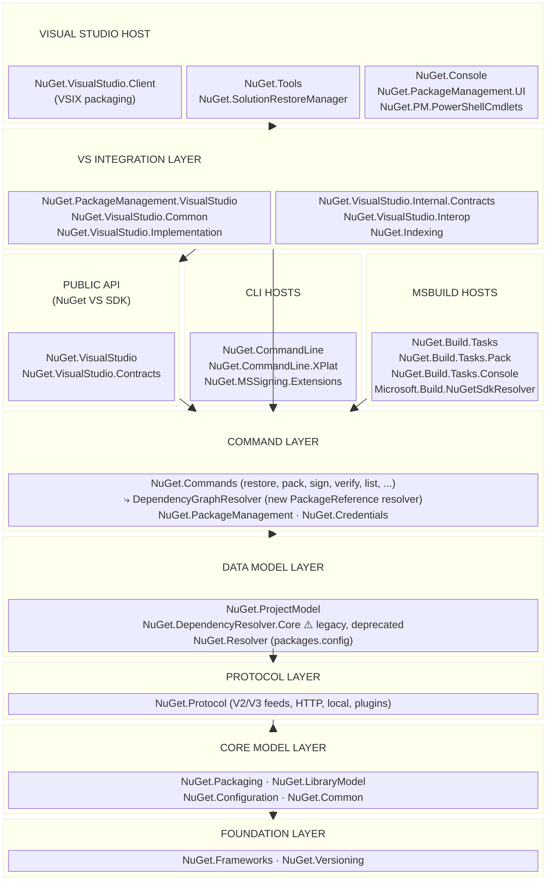

# Architecture

This document describes the high-level architecture of NuGet.Client.
If you want to familiarize yourself with the codebase, you are in the right place!

See also the [feature guide](docs/feature-guide.md) and the [coding guidelines](docs/coding-guidelines.md).

## Bird's Eye View

NuGet is the package manager for .NET. This repository contains the client-side implementation — everything that runs on a developer's machine (or CI) to discover, install, restore, and manage NuGet packages. The server-side (nuget.org, feeds) lives elsewhere.

The repository ships **three distinct products** built from a shared set of core libraries:

1. **Package Manager for Visual Studio** — A Visual Studio extension providing the Package Manager UI dialog, the PowerShell Package Manager Console, solution-level restore integrated with the VS build system, and extensibility APIs for third-party VS extensions.

2. **Command-line tools** — Two separate executables: `NuGet.exe` (a .NET Framework console application, self-contained via ILRepack) and the cross-platform `dotnet nuget` commands (integrated into the .NET SDK via `NuGet.CommandLine.XPlat`).

3. **MSBuild integration** — The `NuGet.Build.Tasks` and `NuGet.Build.Tasks.Pack` libraries provide the MSBuild targets and tasks that power `dotnet restore`, `dotnet pack`, and SDK resolution via `Microsoft.Build.NuGetSdkResolver`.

All three products share a common foundation of core libraries (`src/NuGet.Core/`) that implement package resolution, protocol handling, versioning, configuration, and packaging.

## Repository Layout

The code is organized into a single solution (`NuGet.sln`) with solution filter files (`.slnf`) for loading subsets:

```
NuGet.Client/
├── src/
│   ├── NuGet.Core/         # Platform-independent core libraries (19 projects)
│   └── NuGet.Clients/      # VS extension, NuGet.exe, and VS-specific code (16 projects)
├── test/
│   ├── NuGet.Core.Tests/       # Unit tests for core libraries
│   ├── NuGet.Core.FuncTests/   # Integration tests for core (dotnet, msbuild scenarios)
│   ├── NuGet.Clients.Tests/    # Unit tests for VS and CLI components
│   ├── NuGet.Clients.FuncTests/# Functional tests for NuGet.exe
│   ├── NuGet.Tests.Apex/       # VS UI automation tests
│   └── TestUtilities/          # Shared test infrastructure
├── build/                  # Build props, targets, and shared source files
├── setup/                  # Visual Studio installer (SWIX) packaging
├── docs/                   # Developer documentation
└── eng/                    # Engineering system (CI/CD pipelines)
```

Solution filters for focused development:
- `NuGet-VS.slnf` — Visual Studio extension projects only
- `NuGet-Src-Commandline.slnf` — NuGet.exe and all core libraries
- `NuGet-Src.slnf` — All source projects (no tests)
- `NuGet-UnitTests.slnf` — All source plus unit tests
- `NuGet-Commandline-WithTests.slnf` — CLI projects plus their tests

## Code Map

This section describes the important projects and how they relate to each other. Pay attention to the **Design Rule** sections. They often describe things that are deliberately _absent_ from the code.

The dependency graph flows strictly downward: Visual Studio client code depends on core libraries, never the reverse. Within the core, lower-level libraries (versioning, frameworks) have no upward dependencies.

### Core Libraries (`src/NuGet.Core/`)

These are the foundational libraries shared by all NuGet products. They are multi-targeted (`net472` and `net8.0`) and have no dependency on Visual Studio or any specific host.

#### [`NuGet.Versioning`](src/NuGet.Core/NuGet.Versioning/NuGet.Versioning.csproj)

NuGet's implementation of Semantic Versioning. Defines `NuGetVersion`, `SemanticVersion`, `VersionRange`, `FloatRange`, and version comparison/formatting logic. This is a leaf dependency — it depends on nothing else in the repo.

#### [`NuGet.Frameworks`](src/NuGet.Core/NuGet.Frameworks/NuGet.Frameworks.csproj)

NuGet's understanding of .NET target frameworks. Defines `NuGetFramework`, `CompatibilityProvider`, `FrameworkReducer`, and framework name mappings. Another leaf dependency. The `def/` subdirectory contains the built-in framework compatibility definitions.

**Design Rule:** `NuGet.Versioning` and `NuGet.Frameworks` are leaf libraries with zero internal dependencies. They are usable in isolation.

#### [`NuGet.Common`](src/NuGet.Core/NuGet.Common/NuGet.Common.csproj)

Shared utilities, logging infrastructure (`ILogger`), telemetry, error types, and cross-cutting helpers. Depends only on `NuGet.Frameworks`.

#### [`NuGet.Configuration`](src/NuGet.Core/NuGet.Configuration/NuGet.Configuration.csproj)

Reads and writes NuGet configuration (`NuGet.Config` files). Defines `PackageSource`, `ISettings`, credential storage, proxy configuration, client certificates, and package source mapping. The `Settings/` subdirectory contains the XML read/write logic.


#### [`NuGet.Packaging`](src/NuGet.Core/NuGet.Packaging/NuGet.Packaging.csproj)

NuGet's understanding of `.nupkg` files and `.nuspec` metadata. Provides `PackageArchiveReader`, `NuspecReader`, `PackagesConfigReader`, `PackageExtractor`, content model resolution, and the complete package signing infrastructure (in `Signing/`). Also defines the `NuGet.Packaging.Core` types such as `PackageIdentity` and `PackageDependency`.


**Design Rule:** `NuGet.Packaging` knows how to read and write packages but knows nothing about where they come from (feeds, caches). Feed interaction is handled by `NuGet.Protocol`.

#### [`NuGet.Protocol`](src/NuGet.Core/NuGet.Protocol/NuGet.Protocol.csproj)

Implements communication with NuGet feeds — both the legacy V2 (OData) protocol and the modern V3 (JSON-based) service index protocol. Defines `SourceRepository`, resource providers, HTTP source handling, local folder repositories, and the plugin credential/download system (in `Plugins/`). The `SourceCacheContext` controls HTTP caching behavior.


#### [`NuGet.LibraryModel`](src/NuGet.Core/NuGet.LibraryModel/NuGet.LibraryModel.csproj)

Data model for library/package dependencies. Defines `LibraryRange`, `LibraryIdentity`, `LibraryDependency`, `LibraryType`, and `FrameworkDependency`. These are the types used by the dependency resolver to describe what a project needs.


#### [`NuGet.DependencyResolver.Core`](src/NuGet.Core/NuGet.DependencyResolver.Core/NuGet.DependencyResolver.Core.csproj)

The **legacy** graph-based dependency resolution engine for PackageReference projects. Walks the dependency graph using `GraphNode<T>`, resolving version conflicts and computing the transitive closure. The `Remote/` subdirectory handles fetching dependency info from remote feeds. **This resolver is being deprecated** in favor of the new `DependencyGraphResolver` class in `NuGet.Commands` (see below).


#### [`NuGet.Resolver`](src/NuGet.Core/NuGet.Resolver/NuGet.Resolver.csproj)

The dependency resolver for `packages.config` projects. Uses `PackageResolver` with a different algorithm than the PackageReference resolver. This is the older resolution strategy.


**Design Rule:** There are three resolvers. `NuGet.DependencyResolver.Core` is the **legacy** PackageReference resolver (being deprecated). `DependencyGraphResolver` in `NuGet.Commands` is its **replacement** — the new dependency resolution engine for PackageReference projects. `NuGet.Resolver` handles packages.config. All three share the same lower-level libraries but implement fundamentally different resolution strategies.

#### [`NuGet.ProjectModel`](src/NuGet.Core/NuGet.ProjectModel/NuGet.ProjectModel.csproj)

Defines the data model for PackageReference-based restore: `PackageSpec` (the in-memory representation of a project's NuGet configuration), `DependencyGraphSpec` (the complete restore input graph), `LockFile` / `LockFileFormat` (the `project.assets.json` output), and `ProjectRestoreMetadata`.


#### [`NuGet.Credentials`](src/NuGet.Core/NuGet.Credentials/NuGet.Credentials.csproj)

Credential provider infrastructure. Defines `ICredentialProvider`, `CredentialService`, and the plugin-based credential provider model. Handles authentication handshakes with feeds.


#### [`NuGet.Commands`](src/NuGet.Core/NuGet.Commands/NuGet.Commands.csproj)

High-level command implementations shared by all clients. `RestoreCommand`, `PackCommand`, `SignCommand`, `VerifyCommand`, `ListPackageCommand`, and others. This is the **API Boundary** between the core logic and the various hosts (CLI, VS, MSBuild). Each host translates its inputs into the command argument types defined here, then delegates to the command runners. Also contains `DependencyGraphResolver` (`RestoreCommand/DependencyGraphResolver.cs`), the **new dependency resolution engine** that is replacing the legacy resolver in `NuGet.DependencyResolver.Core`.


**Design Rule:** `NuGet.Commands` is the **primary API boundary**. It contains the shared business logic for operations like restore, pack, and sign. The CLI executables, MSBuild tasks, and VS extension all call into this layer. Nothing in `NuGet.Commands` knows about MSBuild, Visual Studio, or any specific CLI framework.

#### [`NuGet.PackageManagement`](src/NuGet.Core/NuGet.PackageManagement/NuGet.PackageManagement.csproj)

Package management orchestration for install/uninstall/update flows (primarily used by the Visual Studio client and NuGet.exe `install`/`update` commands). Defines `NuGetPackageManager`, the abstract `NuGetProject` base class, and concrete project types like `MSBuildNuGetProject`, `FolderNuGetProject`, and `BuildIntegratedNuGetProject`. The `Audit/` subdirectory handles package vulnerability auditing.


#### [`NuGet.Localization`](src/NuGet.Core/NuGet.Localization/NuGet.Localization.csproj)

Localization satellite assemblies for the dotnet CLI. Leaf dependency.

### MSBuild Integration (`src/NuGet.Core/`)

#### [`NuGet.Build.Tasks`](src/NuGet.Core/NuGet.Build.Tasks/NuGet.Build.Tasks.csproj)

MSBuild tasks and targets that implement `dotnet restore` and `msbuild /t:Restore`. The `RestoreTask` class delegates to `RestoreCommand` from `NuGet.Commands`. Ships the `NuGet.targets` and `NuGet.props` files that are imported by the .NET SDK into every project.

Also contains the `NuGet.RestoreEx.targets` file used for static graph restore, which uses MSBuild's static graph APIs to evaluate the project graph for better performance.


#### [`NuGet.Build.Tasks.Console`](src/NuGet.Core/NuGet.Build.Tasks.Console/NuGet.Build.Tasks.Console.csproj)

A standalone console executable (`NuGet.Build.Tasks.Console.exe`) that runs restore using MSBuild's static graph functionality. This is the out-of-process restore host invoked by the `RestoreTaskEx` MSBuild task for improved performance.


#### [`NuGet.Build.Tasks.Pack`](src/NuGet.Core/NuGet.Build.Tasks.Pack/NuGet.Build.Tasks.Pack.csproj)

MSBuild tasks and targets for `dotnet pack`. The `PackTask` class creates `.nupkg` files from project metadata. Ships the `NuGet.Build.Tasks.Pack.targets` file. Supports multi-targeted projects and symbol packages.


#### [`Microsoft.Build.NuGetSdkResolver`](src/NuGet.Core/Microsoft.Build.NuGetSdkResolver/Microsoft.Build.NuGetSdkResolver.csproj)

An MSBuild SDK resolver (priority 6000) that resolves MSBuild SDKs distributed as NuGet packages. Reads the `msbuild-sdks` section from `global.json` and performs a NuGet restore to obtain the SDK package. Can be disabled via the `MSBUILDDISABLENUGETSDKRESOLVER` environment variable. Avoids loading NuGet assemblies unless an SDK actually needs resolution.


### Command-Line Tools

#### [`NuGet.CommandLine`](src/NuGet.Clients/NuGet.CommandLine/NuGet.CommandLine.csproj) (`src/NuGet.Clients/`)

The `NuGet.exe` console application. Targets .NET Framework 4.7.2 only. Uses **ILRepack** to merge all dependent assemblies into a single self-contained executable. Commands are discovered via MEF (`[Export]` attributes on `ICommand` implementations), and third-party extensions can be loaded from configurable extension directories.

The `Program` class is the entry point. `CommandManager` handles command registration and dispatch.


**Design Rule:** `NuGet.CommandLine` is .NET Framework only. It is the legacy CLI tool. The cross-platform equivalent is `NuGet.CommandLine.XPlat`.

#### [`NuGet.CommandLine.XPlat`](src/NuGet.Core/NuGet.CommandLine.XPlat/NuGet.CommandLine.XPlat.csproj) (`src/NuGet.Core/`)

The cross-platform CLI that powers `dotnet nuget` commands. Integrated into the .NET SDK — the SDK calls `NuGetCommands.Add(RootCommand, ...)` to register NuGet's commands into the `dotnet` command tree. Uses a mix of `System.CommandLine` (newer commands like `config`, `why`, `package search`) and `Microsoft.Extensions.CommandLineUtils` (older commands like `delete`, `push`, `locals`).


**Design Rule:** despite living under `src/NuGet.Core/`, this project is an executable entry point, not a reusable library. It lives in `NuGet.Core` because it targets modern .NET only and has no Visual Studio dependencies.

### Visual Studio Extension (`src/NuGet.Clients/`)

The VS extension is packaged as a VSIX (`NuGet.VisualStudio.Client`) and ships as a system component of Visual Studio. It registers two `AsyncPackage` classes, exposes functionality via MEF exports, and provides brokered services for out-of-process access.

#### [`NuGet.Tools`](src/NuGet.Clients/NuGet.Tools/NuGet.Tools.csproj)

The main Visual Studio package. `NuGetPackage` (inherits `AsyncPackage`) registers menu commands, tool windows, settings pages, brokered services, and the NuGet search provider. It is the entry point that wires together the Package Manager UI, the PowerShell Console, and all NuGet services within VS.

Key responsibilities: launches the Package Manager dialog (project-level and solution-level), hosts the `PowerConsoleToolWindow`, registers brokered services via `NuGetBrokeredServiceFactory`, and persists solution-level user options.


#### [`NuGet.SolutionRestoreManager`](src/NuGet.Clients/NuGet.SolutionRestoreManager/NuGet.SolutionRestoreManager.csproj)

The second VS package. `RestoreManagerPackage` auto-loads when a solution is open and hooks into VS build events. By design, it contains a slimmed-down version of the NuGet assemblies, allowing this functionality to be loaded early without paying a performance cost. `SolutionRestoreBuildHandler` triggers restore before build. `SolutionRestoreWorker` executes restore jobs. `VsSolutionRestoreService` exposes restore as a brokered service.

Also provides the `AuditCheckResultCachingService` for vulnerability checks and `VulnerablePackagesInfoBar` for user notifications.


#### [`NuGet.PackageManagement.UI`](src/NuGet.Clients/NuGet.PackageManagement.UI/NuGet.PackageManagement.UI.csproj)

WPF-based Package Manager dialog. `PackageManagerControl` is the main UI control. `NuGetUIFactory` creates UI contexts. `PackageItemLoader` handles lazy-loading with infinite scroll. The UI communicates with the core through brokered service proxies defined in `NuGet.VisualStudio.Internal.Contracts`.


#### [`NuGet.Console`](src/NuGet.Clients/NuGet.Console/NuGet.Console.csproj)

The PowerShell Package Manager Console. `PowerConsoleToolWindow` hosts a WPF-based terminal. `WpfConsoleService` manages the console output. Provides IntelliSense via `CompletionSourceProvider` and syntax highlighting via `ClassifierProvider`.

#### [`NuGet.PackageManagement.PowerShellCmdlets`](src/NuGet.Clients/NuGet.PackageManagement.PowerShellCmdlets/NuGet.PackageManagement.PowerShellCmdlets.csproj)

PowerShell cmdlet implementations (`Install-Package`, `Update-Package`, `Uninstall-Package`, `Get-Package`, etc.) that run within the Package Manager Console. These cmdlets call into `NuGet.PackageManagement` for the actual operations.

#### [`NuGet.PackageManagement.VisualStudio`](src/NuGet.Clients/NuGet.PackageManagement.VisualStudio/NuGet.PackageManagement.VisualStudio.csproj)

VS-specific package management infrastructure. `VSSolutionManager` tracks the loaded solution and projects. Provides project system adapters (`CpsPackageReferenceProjectProvider`, `LegacyPackageReferenceProjectProvider`, `MSBuildNuGetProjectProvider`) that bridge the VS project system to `NuGetProject` types in `NuGet.PackageManagement`. Also handles VS credentials, settings, and source control integration.


#### [`NuGet.VisualStudio.Common`](src/NuGet.Clients/NuGet.VisualStudio.Common/NuGet.VisualStudio.Common.csproj)

Shared infrastructure used by all VS client projects. Contains telemetry (`NuGetTelemetryProvider`), experimentation/A/B testing (`NuGetExperimentationService`), the error list integration, output window logging, and the `ServiceLocator` that provides static access to MEF-composed services.


#### [`NuGet.VisualStudio`](src/NuGet.Clients/NuGet.VisualStudio/NuGet.VisualStudio.csproj)

The public extensibility API for third-party VS extensions. Defines interfaces like `IVsPackageInstaller`, `IVsPackageUninstaller`, `IVsPackageRestorer`, `IVsFrameworkParser`, and `IVsPathContextProvider`. Also defines the `IVsSolutionRestoreService` interface for restore manager interop. This is an **API boundary** — it is a NuGet package consumed by third-party extensions. Part of the **NuGet VS SDK** (see [NuGet API in Visual Studio](https://learn.microsoft.com/en-us/nuget/visual-studio-extensibility/nuget-api-in-visual-studio)).

**Design Rule:** `NuGet.VisualStudio` is a leaf dependency containing only interfaces and simple types. It has no dependency on any other NuGet assembly. This allows third-party extensions to reference it without pulling in the entire NuGet stack. Because this is a public SDK, any changes to its API surface constitute **breaking changes** and must follow the team's breaking-change process.

#### [`NuGet.VisualStudio.Contracts`](src/NuGet.Clients/NuGet.VisualStudio.Contracts/NuGet.VisualStudio.Contracts.csproj)

Public Service Broker extensibility contracts. Defines `INuGetProjectService` for out-of-process VS extensions to query installed packages. Like `NuGet.VisualStudio`, this is a leaf dependency shipped as a NuGet package. Part of the **NuGet VS SDK** (see [NuGet API in Visual Studio](https://learn.microsoft.com/en-us/nuget/visual-studio-extensibility/nuget-api-in-visual-studio)).

**Design Rule:** `NuGet.VisualStudio.Contracts` has no internal NuGet dependencies, keeping the public API surface minimal and stable. As with `NuGet.VisualStudio`, any API changes here are **breaking changes** and must follow the team's breaking-change process.

#### [`NuGet.VisualStudio.Implementation`](src/NuGet.Clients/NuGet.VisualStudio.Implementation/NuGet.VisualStudio.Implementation.csproj)

Implements the extensibility interfaces from `NuGet.VisualStudio`. `VsPackageInstaller`, `VsPackageRestorer`, `VsPackageUninstaller`, `VsFrameworkParser`, `VsPathContextProvider` are all MEF exports. Also provides the Solution Explorer integration (`PackageReferenceAttachedCollectionSourceProvider`) and template wizard support (`VsTemplateWizard`).

#### [`NuGet.VisualStudio.Internal.Contracts`](src/NuGet.Clients/NuGet.VisualStudio.Internal.Contracts/NuGet.VisualStudio.Internal.Contracts.csproj)

Internal service contracts for brokered service communication within VS. Defines `INuGetSolutionManagerService`, `INuGetProjectManagerService`, `INuGetSearchService`, `INuGetSourcesService`, and `INuGetProjectUpgraderService`. These are not part of the public API. Uses MessagePack serialization for RPC.

#### [`NuGet.VisualStudio.Interop`](src/NuGet.Clients/NuGet.VisualStudio.Interop/NuGet.VisualStudio.Interop.csproj)

COM interop assembly for the VS template wizard. Bridges `NuGet.VisualStudio.Implementation` template wizard to VS via COM. Depends only on `NuGet.VisualStudio`.

#### [`NuGet.VisualStudio.Client`](src/NuGet.Clients/NuGet.VisualStudio.Client/NuGet.VisualStudio.Client.csproj)

The VSIX project that packages the entire VS extension. Contains the `source.extension.vsixmanifest` that declares all VS packages, MEF components, and bundled assemblies. This is not a code project — it is the packaging and deployment artifact.

#### [`NuGet.Indexing`](src/NuGet.Clients/NuGet.Indexing/NuGet.Indexing.csproj)

Package search indexing and result aggregation for the VS Package Manager UI. Uses Lucene.Net for relevance ranking and `SearchResultsAggregator` to merge results from multiple feeds.

#### [`NuGet.MSSigning.Extensions`](src/NuGet.Clients/NuGet.MSSigning.Extensions/NuGet.MSSigning.Extensions.csproj)

Extension commands for repository signing (`NuGet.exe reposign`, `NuGet.exe sign`). Extends `NuGet.CommandLine` with additional signing functionality.

## Dependency Layers

The projects form a strict layering. Dependencies flow downward only:



## Cross-Cutting Concerns

### Shared Source Files

The `build/Shared/` directory contains `.cs` files that are compiled directly into multiple assemblies via `<Compile Include="$(SharedDirectory)\..." />` in project files. This avoids adding assembly dependencies for small utility code. Key shared files include `HashCodeCombiner.cs`, `XmlUtility.cs`, `SharedExtensions.cs`, `TaskResult.cs`, and `Utf8JsonStreamReader.cs`.

### Multi-targeting

Core libraries target `net472` and `net8.0` (defined as `TargetFrameworksLibrary` in `build/common.project.props`). Executable projects (XPlat CLI, Build.Tasks.Console) target `net472` and `net10.0` (`TargetFrameworksExe`). The VS client projects target `net472` only. The sole exception is `NuGet.VisualStudio.Contracts`, which targets `netstandard2.0` for maximum consumer compatibility.

### Central Package Management

All NuGet package versions are centrally managed in the root `Directory.Packages.props` file (110+ dependencies). Individual projects use `<PackageReference Include="..." />` without specifying versions — the version comes from the central file.

### Brokered Services (VS)

The VS extension uses Visual Studio's brokered service infrastructure for RPC communication. Services are defined in `NuGet.VisualStudio.Internal.Contracts` and registered in `NuGetBrokeredServiceFactory` (in `NuGet.Tools`). This architecture allows NuGet services to be accessed from out-of-process VS extensions. Serialization uses MessagePack.

### MEF Composition (VS)

The VS extension uses MEF (Managed Extensibility Framework) extensively for service discovery and dependency injection. Key exports include `VSSolutionManager`, `ExtensibleSourceRepositoryProvider`, `NuGetUIFactory`, `VsPackageInstaller`, and the PowerShell console providers.

### Two Extensibility Models (VS)

NuGet exposes two VS extensibility surfaces:
- **In-process (MEF):** `NuGet.VisualStudio` interfaces (`IVsPackageInstaller`, etc.) — consumed by third-party extensions loading in the same VS process.
- **Out-of-process (Service Broker):** `NuGet.VisualStudio.Contracts` (`INuGetProjectService`) — consumed by extensions that may run out-of-process.

Together these two packages form the **NuGet VS SDK** ([docs](https://learn.microsoft.com/en-us/nuget/visual-studio-extensibility/nuget-api-in-visual-studio)). Both are leaf assemblies with no internal NuGet dependencies, ensuring a stable public API surface.

**Design Rule:** Any changes to the APIs in `NuGet.VisualStudio` or `NuGet.VisualStudio.Contracts` are **breaking changes** for external consumers and must follow the team's breaking-change process. Treat these two assemblies with extreme care during code reviews.

### Build System

The build uses MSBuild with shared properties in `Directory.Build.props` / `Directory.Build.targets` at the root, and layer-specific overrides in `src/NuGet.Core/` and the individual project directories. The `build/` directory contains common build configuration (`config.props`, `common.project.props`). CI/CD is configured in `eng/` and `.azuredevops/`. The `build.cmd` / `build.ps1` scripts are the top-level build entry points.

### Testing Strategy

Tests are organized to mirror the source structure:
- **Unit tests** (`test/NuGet.Core.Tests/`, `test/NuGet.Clients.Tests/`) — fast, isolated tests for individual libraries.
- **Functional tests** (`test/NuGet.Core.FuncTests/`, `test/NuGet.Clients.FuncTests/`) — integration tests that exercise real MSBuild, dotnet CLI, or NuGet.exe scenarios.
- **Apex tests** (`test/NuGet.Tests.Apex/`) — VS UI automation tests using the Test.Apex framework.

Test utilities in `test/TestUtilities/` provide mock feeds, test project scaffolding, and shared test infrastructure.
