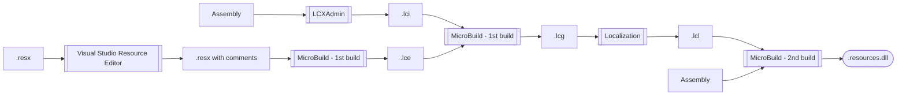

# Localizability

To enable localization, your strings must first be localizable.  Practically speaking, this means:

* You put the string in a resource file (.resx).
* You added necessary functional and contextual comments for the resource string.
* You used the string resource instead of a string literal or format string literal.

## Resource commenting

[This internal site][0] has a good explanation of the what, why, and how of resource commenting.  In brief, resource comments can contain both:

* functional comments, which enable tools to understand your intent
* contextual comments, which enable human translators to understand your intent

Both are important.

For Arcade-based builds that use [OneLocBuild][1], adding resource comments can be done using the same Visual Studio Resource Editor that you use to add and modify resource strings in .resx files.

Unfortunately, NuGet.Client does not use OneLocBuild, and any resource comments in its .resx files are [ignored][2].  The only way to comment resource strings is by editing .lci files in the NuGet.Build.Localization repository [here][3] using [lcxadmin.exe][4].  Having resource strings in one repository (NuGet.Client) and resource comments in another repository (NuGet.Build.Localization) is suboptimal.

## How NuGet assemblies get localized (high-level)

Although the steps below are for the dev branch, the process is similar for release branches.

1. A PR merges into the dev branch.
1. A NuGet.Client build generates a `localizationArtifacts` artifact.  This artifact contains newly built (but unsigned) assemblies and .lcg files.  The .lcg files contain information extracted from .resx files and are the primary input for later localization.
1. The localization team grabs the `localizationArtifacts` artifact from a NuGet.Client build.
1. The localization team localizes strings and merges a ["LEGO" PR][5] with localized strings (in .lcl files).
1. During the next NuGet.Client build, the build adds the [NuGet.Build.Localization][6] repository as a submodule of the NuGet.Client repository and checks out a branch of the same name as the NuGet.Client repository (e.g.:  dev, release-6.7.x, etc.).  Localized resources are [made available][7] to localized builds through the `NuGetBuildLocalizationRepository` property.
1. When the build completes, the product is localized using localizations base on an earlier commit.  (This means strings added since then won't be localized.)

Typically, the data flow would look something like this.  However, because NuGet.Client's build ignores resource comments in .resx files, those comments and .lce files do not contribute to the localization process.



File Type | Contains | Created By | Location
-- | -- | -- | --
.resx | resource strings | engineers using Visual Studio | NuGet/NuGet.Client repo
.lci | resource comments | engineers using [lcxadmin.exe][4] | [NuGet.Build.Localization][6] repo
.lce | resource comments (extracted from .resx file) | MicroBuild | build artifact
.lcg | resource comments (from .lci and .lce files) | MicroBuild | build artifact
.lcl | localized strings | translators | [NuGet.Build.Localization][6] repository
.resources.dll | localized resource assembly | MicroBuild | build artifact

## How to add resource comments

In this walkthrough, we will add resource comments for the `ConflictingAllowUntrustedRoot` resource string in NuGet.Packaging.dll.

1. Find the latest NuGet.Client build for the commit containing strings you want to localize and having a `localizationArtifacts` artifact.
1. Download the `localizationArtifacts` artifact.
1. Extract the contents of the downloaded artifact ZIP file.
1. Clone the [NuGet.Build.Localization][6] repository.
1. Make sure you're in the dev branch and pull the latest changes.
1. Create a new branch off of dev where you will make your changes.
1. In the NuGet.Build.Localization repository, launch the LCXAdmin tool (`tools\lcxadmin.exe`).  Note:  the first time you launch the tool you will be prompted to install .NET Framework 3.5.
1. Navigate on LCXAdmin's main menu to File | "Open Source File..."
1. In the subsequent "Open Source File" dialog, from the extracted `localizationArtifacts` directory open localizationArtifacts\artifacts\localize\ENU\NuGet.Packaging\bin\release\net472\NuGet.Packaging.dll.lcg.
1. When prompted with "Do you want to open Comments file?" click Yes.
1. In the subsequent "Open Comments File" dialog, from the NuGet.Build.Localization repository root directory select localize\comments\15\NuGet.Packaging.dll.lci.
1. In LCXAdmin's left-hand tree pane, navigate to Files | NuGet.Packaging.dll.lcg | "Managed Resources" | NuGet.Packaging.Strings.resources | Strings.
1. In LCXAdmin's right-hand details pane and in the Resources tab, find the row with Resource ID `0; ConflictingAllowUntrustedRoot` and double-click it.
1. In the subsequent "String Properties" dialog, on the main toolbar click the Locked button (🔒).
1. In the subsequent "Add Locked Rule" dialog, enter `allowUntrustedRoot` for the `Parameters` property value and click OK.
1. Repeat the previous step for `false`.
1. Back in the subsequent "String Properties" dialog in the "LcxAdmin Comment" tab, you'll see functional comments for the resource string.  Add contextual comments, like so.
   ```text
   {Locked="allowUntrustedRoot"} is the name of an option in NuGet.config file, while {Locked="false"} is a literal value for the option.
   ```
1. In the "Resource String" textbox, verify that the substrings you locked are still highlighted.  (If your edits in the previous step impacted functional comment parsing, you might not see some substrings highlighted.)
1. In the Verification tab, verify that no issues are listed.  It is possible that in the step where you added contextual comments you also introduced a problem that blocks tools from parsing functional comments correctly.  If you did, you'd see one or more issues here.  Fix all issues.
1. Click OK.
1. On LCXAdmin's main menu, select File | "Save Comments File..."
1. Review and commit branch changes (with git).
1. Create a PR targeting the dev branch.

After saving the comments file, you may have noticed other unrelated changes in the .lci file.  LCXAdmin can detect when the .lci file is out of sync with the .lcg file.  For example, if a resource string has been removed, it will not be in the .lcg file.  LCXAdmin will notice this and remove the resource string from the .lci file.  These "extra" changes are fairly common.  Because our .lci files haven't been updated in a long time, it's likely you'll see an unusually high number of .lci file changes the next time you update it.

## Do's and Don'ts

If you want your strings localized properly...

❌ Do not use string literals.  Example:

```C#
private void DoSomething(ILogger logger)
{
    ...
    logger.LogWarning("This is a warning.");
}
```

❌ Do not use format string literals.  Example:

```C#
private void DoSomething(ILogger logger)
{
    ...
    string message = string.Format("'{0}' is not a valid version.", version);

    logger.LogError(message);
}
```

✔️ Do use resource strings.  Example:

```C#
private void DoSomething(ILogger logger)
{
    ...
    string message = string.Format(Strings.DownloadingPackage, packageId, packageVersion);

    logger.LogInformation(message);
}
```

✔️ Do add appropriate functional and contextual comments.  [Here][8] is an example of a functional comment.  Our .resx files contain contextual comments, but the comments do not flow automatically into .lcg files.  [Here][9] is an example of a .resx comment (in a different repository) which has both functional and contextual commenting.

## Resources

* [All About Localization][10]
* [Simplified Resource Commenting][0]
* [MicroBuild Localization][11]

[0]: https://aka.ms/commenting
[1]: https://github.com/dotnet/arcade/blob/main/Documentation/OneLocBuild.md
[2]: https://github.com/search?q=repo%3ANuGet%2FNuGet.Client%20HasLceComments&type=code
[3]: https://github.com/NuGet/NuGet.Build.Localization/tree/dev/localize/comments
[4]: https://github.com/NuGet/NuGet.Build.Localization/blob/dev/tools/lcxadmin.exe
[5]: https://github.com/NuGet/NuGet.Build.Localization/pulls?q=is%3Apr+LEGO
[6]: https://github.com/NuGet/NuGet.Build.Localization
[7]: https://github.com/search?q=repo%3ANuGet%2FNuGet.Client%20NuGetBuildLocalizationRepository&type=code
[8]: https://github.com/NuGet/NuGet.Build.Localization/blob/931c5f21742fff61c7f53a19039b89dddc7a01cd/localize/comments/15/NuGet.Packaging.dll.lci#L58-L66
[9]: https://github.com/dotnet/sign/blob/ef0e6b3ef8281dff1d62cea34445bd88fc3e6714/src/Sign.Core/Resources.resx#L131-L134
[10]: https://aka.ms/allaboutloc
[11]: https://devdiv.visualstudio.com/DevDiv/_wiki/wikis/DevDiv.wiki/20709/MicroBuild-Localization