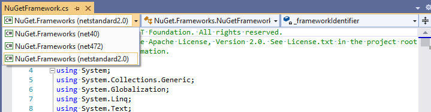

# NuGet SDK

NuGet is primarily a tool, but we also publish packages that others can reference in their own projects. All of these packages are published to NuGet.org with the [`NuGet.` prefix](https://www.nuget.org/packages?q=nuget.*). Documentation on the NuGet SDK is on our docs site [https://docs.microsoft.com/nuget/reference/nuget-client-sdk](https://docs.microsoft.com/nuget/reference/nuget-client-sdk)

The projects that are part of the SDK are largely under `src\NuGet.Core`, but also include `NuGet.VisualStudio` and `NuGet.VisualStudio.Contracts` under `src\NuGet.Clients`, which define the interfaces for our Visual Studio extensibility APIs.

## API compatibility policy

NuGet is primarily a tool, and as such our efforts are focused on: Visual Studio integration, `dotnet` cli integration, `msbuild` integration, and `nuget.exe`.

When we need to break APIs part of the SDK to meet our tooling needs, we will do so. However, we understand this negatively impacts customers using the SDK, so we will try to avoid doing so by trying to be attentive in code reviews, and using tooling such as the [PublicApiAnalyzers](https://github.com/dotnet/roslyn-analyzers/tree/master/src/PublicApiAnalyzers).

Note that `NuGet.PackageManagement` is a special case. `NuGet.PackageManagement` contains classes closely tied to our Visual Studio tooling, but the APIs are not designed in a way that makes it easy to avoid breaking changes. This means their APIs are far less stable than our other packages, as we need to make changes for Visual Studio specific features.

### Types of compatibility

There are two types of compatibility:

* Application Programming Interface (API)

This is what is used at compile time. If someone has existing source code that compiles with one version of the SDK, will their code compile when they upgrade to a new version of the SDK?

* Application Binary Interface (ABI)

This is what is used at runtime. Imagine a customer has a class library that is packed into its own nupkg, which depends on a NuGet SDK package. This customer's package is used in a project, and the project upgrades to a newer version of the NuGet SDK than the customer's package depends on. Will the customer's package still work?

**Examples**:

* Adding optional parameters

Modifying an existing method to add optional parameters maintains API compatibility, because source code will still compile given the new parameter is optional (has a default value if not specified). However, already-compiled assemblies will have references to the old method signature. The method with the optional parameter will have a different signature. Therefore the assembly will fail at runtime with a `MethodNotFoundException`. Hence adding an optional parameter breaks ABI compatibility.

* Moving/renaming members

Changing namespaces, type names, member names breaks both API and ABI compatibility. If it's done for a sufficiently good reason, it may be possible to use type forwarding.

* Adding members to interfaces

Any class implementing the interface will break both API and ABI compatibility (unless using C#8's default implementation feature). Note that some interfaces, particularly those defined in `NuGet.VisualStudio` and `NuGet.VisualStudio.Contracts`, are not intended to be implemeneted by customers, they are defining interfaces that NuGet implements and customers can get/use. Therefore, adding members to those interfaces are acceptable.

## Changes to APIs

While the NuGet team does not have an API design process, if you contribute changes to any projects that make up the NuGet SDK try to make a best effort. For example, consider:

* If a customer is referencing the assembly you are modifying, does the API make sense without the context of the full PR you are creating?
* Does the change make it possible for classes to be put in an invalid state if not used correctly?
* Can any classes being added or modified have multithreading issues?
* Is it easy to use the API, or does it require complex setup before the new API can be called?
* Is the API a little bit too specific to the scenario you're working on, and could the API be made a little bit more generic to provide value to customers with slightly different use-cases?
* Is the API within the scope of the assembly? For example, APIs related to `nuget.config` files belong in the `NuGet.Configuration` assembly. The `NuGet.Protocol` assembly is for APIs related to querying and downloading packages from package sources, so generic helper methods for `HttpClient` or JSON conversion do not belong (remember the [leaky abstraction](https://en.wikipedia.org/wiki/Leaky_abstraction) code smell)
* If you are modifying the SDK as part of a change for a project that is not part of the SDK, does the API you are creating belong in the other project where we do not have API/ABI compatibility concerns?
* Do all of your public APIs need to be public, or can any be made internal?
* If there was an API design review panel, and you were a member of it, if someone else proposed the API you're adding, would you approve it? If you worked on the NuGet team, would you be willing to support the API for years to come?

Ideally once an API is part of the SDK, it is "set in stone" and can "never" change. We have no way to determine if anyone is using an API, or how commonly different APIs are being used. Therefore the barrier to adding new APIs should be high, since we cannot assess the impact of removing or breaking an API.

## PublicApiAnalyzer

The NuGet.Client repo now uses [PublicApiAnalyzers](https://github.com/dotnet/roslyn-analyzers/tree/master/src/PublicApiAnalyzers) on the projects that make up the NuGet SDK. This helps the team detect changes, and is a signal to the developer making the change to consider the design recommendations above, and a signal to code reviews to consider the same recommendations.

Using the PublicApiAnalyzers changes the NuGet development and release lifecycle in the following ways:

### Development

Each project in the NuGet SDK will have a `PublicAPI.Shipped.txt` and `PublicAPI.Unshipped.txt` file, as required by the analyzer. Most NuGet projects (possibly all NuGet SDK projects) multitarget, and when a project has the same public API surface for all Target Frameworks (TFMs), they will use a single pair of files in the project root. When a project has different public API surface, each TFM will have their own pair of files in the `PublicAPI\<tfm>\` folder in the project.

When an API is added, the analyzer will display errors unless the API is added to `PublicAPI.Unshipped.txt`. Note:

* The analyzer will also stop complaining if the API is added to `PublicAPI.Shipped.txt`. However, new APIs should not be added to this file. Always add new APIs to the `Unshipped` file.
* Adding APIs to the text file can be accomplished by using the analyzer's code-fix from Visual Studio. Developers not using Visual Studio (for example VSCode) may need to find alternative methods.
  * The analyzer code-fix only adds the API to the currently selected TFM's `PublicAPI.Unshipped.txt` file. For projects that have different public APIs per TFM, developers will need to repeat the code-fix for each target framework, or manually copy-paste the same changes in all `PublicAPI.Unshipped.txt` in all TFM directories. To run the code fix for each TFM, see the left-most drop-down at the code of Visual Studio's code editor.
  * 

### Code Review

Unless a PR is specifically for the intent of moving APIs from `PublicAPI.Unshipped.txt` to `PublicAPI.Shipped.txt` because a new version of NuGet was shipped, any PR adding APIs to `PublicAPI.Shipped.txt` should be questioned.

Any PR removing APIs from `PublicAPI.Shipped.txt` should be seriously questioned. This indicates a breaking change for customers using the NuGet SDK. Usually overloads can be added to avoid breaking changes.

Any removals to `PublicAPI.Unshipped.txt` should be acceptable as when this document's procedures are followed, at worst there are pre-release packages on nuget.org that have the API, but prerelease packages do not have any compatibility promises. Customers using package versions without SemVer2 pre-release labels will not be impacted.

Any additions to `PublicAPI.Unshipped.txt` should be considered, particularly using the ideas in the [Changes to APIs section](#Changes_to_APIs) above

### Shipping NuGet

When NuGet ships a GA release, packages without pre-release versions are published to nuget.org. At this time all APIs listed in any `PublicAPI.Unshipped.txt` should be moved to `PublicAPI.Shipped.txt`. This must be done on the release-#.#.x branch, then should be ported onto the dev branch. Moving APIs from `PublicAPI.Unshipped.txt` to `PublicAPI.Shipped.txt` should be done using [`tools-local\ship-public-apis\`](../tools-local/ship-public-apis/) -- from root of enlistment, you can run: "dotnet run --project tools-local\ship-public-apis\ship-public-apis.csproj".
