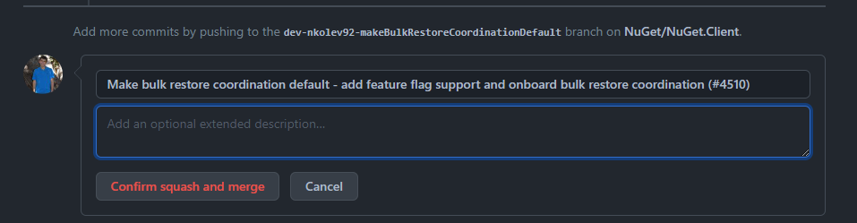
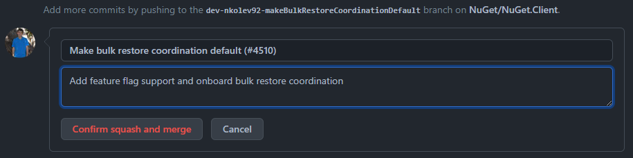
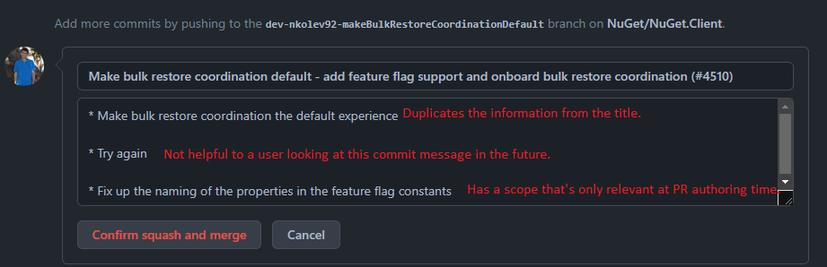
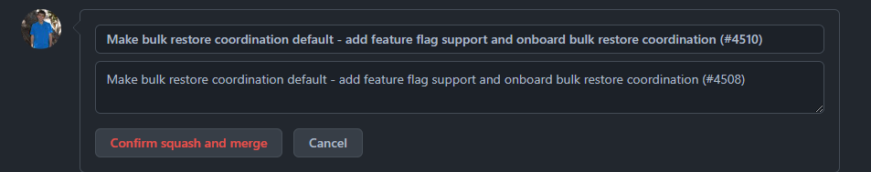

# Workflow Guidelines

In here we describe the general workflow guidelines the NuGet developer/contributor.

## Pull Requests & Code Reviews
To help ensure that only the highest quality code makes its way into the project, all code changes need to be submitted to GitHub as PRs.
This repo has bots that manage all stale PRs.
Stale PRs will be autoclosed.

The following guidelines should be viewed as suggestions, unless explicitely stated they are required.

### Requesting a Pull Request
- **Required**: Include the Subject Matter Expert (SME) for the area you are working on. If you don't know the SME, someone on the team will help you identify them.
- Follow the pull request template, as it helps the maintainers drive quality across the product.
- Request at least 2 reviewers, and re-request their review when feedback has been addressed.
- Include screenshots and PM when making UX changes.
- Include perf traces when making performance improvements.
- Focus on small, iterative, changes when possible.

### Addressing Feedback
- Try your best not to take feedback personally, we're all working towards the same goals.
- When conflict arises try to address it directly with the commentor offline, preferably synchronously.
- Provide an explantion if you decide not to implement a recommendation.
- Focus on collaboration when responding to feedback.
- Use GitHub's tooling. Re-request review after feedback has been addressed.

### Merging Pull Requests
- **Required:** All comments must be resolved before merging.
- **Required**: use the GitHub `Squash and Merge` button for this repository.
- Merge a PR when you are confident it has been sufficiently reviewed.
- When possible wait 24h after the last signficant change before merging.
- Ensure commit message is descriptive and helpful

### Providing Pull Request Feedback
- Use [suggested changes](https://docs.github.com/pull-requests/collaborating-with-pull-requests/reviewing-changes-in-pull-requests/commenting-on-a-pull-request#adding-line-comments-to-a-pull-request), but please never commit them for a PR you did not create.

- Make sure your intent is clear.
  - State your suggestion clearly in the comment, before explaining or justifying it.
  - Use "nit" or "non-blocking" for optional suggestions.
- Ensure the subject of your feedback is the code and not the PR author.
- Use soft language if you have to address the author directly.

#### When to mark a PR as "Approved"
- You feel confident that the code meets a high quality bar, has adequate test coverage, is ready to merge.
- Any comments left are uncontroversial and do not need to be resolved before merging.
- Previous feedback has been sufficiently addressed.
#### When to leave comments without approval
- You are not confident you can approve the PR with the requirements stated above.
- You have feedback that you would like addressed but do not want to block the PR from merging.
#### When to mark a PR as "Request Changes"
- You have significant concerns that must be addressed before this PR should be merged such as unintentional breaking changes, security issues, or potential data loss.

### Draft Pull Requests

Draft pull requests are allowed, but should have a clear plan for transition to a review ready pull request.

## Branching strategy

The active development branch in our repo is `dev`. What we ship comes from the `release-major.minor.x` branches.

### Adding fixes in release branches

NuGet primarily works on the dev branch and that's where most of the commmits will be merged. At a certain point, NuGet branches to a release branch during the release stabilization phase and the last few commits usually go into that branch.

In most cases, a fix will be originally developed on the dev branch and then moved to the release branch.
When moving to the release branch the recommended approach is the following:

- Create a new branch based on the release branch.
- Cherry pick the commit of interest
- Push
- Create a Pull Request against the release branch.

The cherry-picked request does not need to be reviewed, but when the build passes it can be merged.
Normally, you would only cherry pick on commit per Pull Request, so that in case a change needs reverted, only that single commit will be affected.
The recommended pattern for release branches is slightly different. We should preserve the original commit message one can follow the original Pull Request.

## Solution and project folder structure and naming

The NuGet.Client repo currently has only one solution file named `NuGet.sln`. We do not want/need to have more than one solution file.
We have some Solution Filters (.slnf files), currently for projects specific to working with NuGet's Command line, VS, or UnitTests directly, and can consider more based on team and community feedback.

- Every project in the NuGet.Client repo should be [PackageReference-based](https://docs.microsoft.com/en-us/nuget/consume-packages/package-references-in-project-files) based and if possible (read this as not .NET Framework WPF), an [SDK-based](https://docs.microsoft.com/en-us/visualstudio/msbuild/how-to-use-project-sdk) one.
- The production source code is under the `src` folder.
- The test source code is under the `test` folder.
- The files affecting build are located under the `build` folder.
- The PowerShell files that are not part of the `Package Manager Console` are located under the `scripts` folder.

Follow the existing pattern for new project files (for example, if NuGet.Commands imports common.props at some point, so should NuGet.MyNewProject).
Test projects have a different convention for the build customization files they import, so be mindful of that.

## Project naming pattern

The general naming pattern is `NuGet.<area>.<subarea>`.

- All NuGet assemblies ship together and follow the same assembly versioning, save for some exceptions like `NuGet.VisualStudio.Interop`.
- All assemblies have the same name as their project.
- All package versions are the same. No exceptions.
