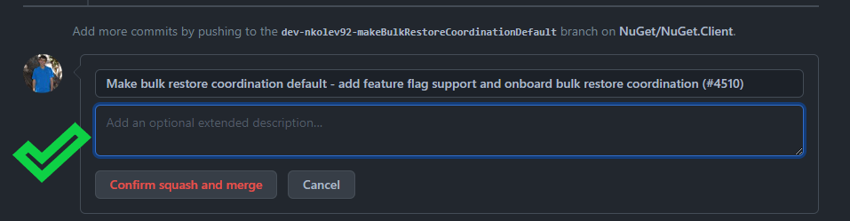
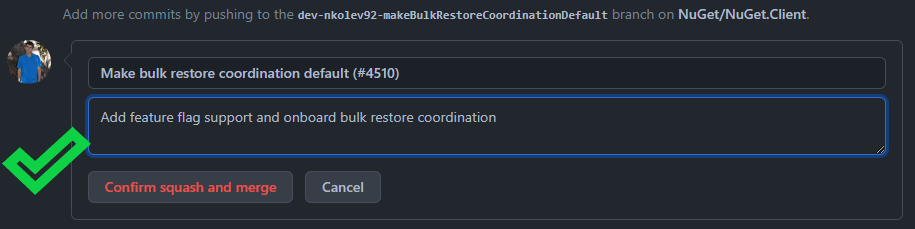
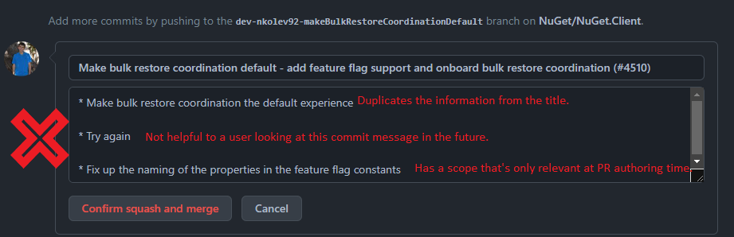
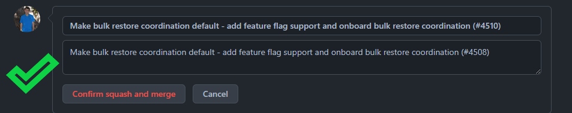

# Workflow

In here we describe the general workflow guidelines the NuGet developer/contributor.

## Basics

### Pull requests & Code reviews

To help ensure that only the highest quality code makes its way into the project, all code changes need to be submitted to GitHub as PRs.

In general a PR should be approved by the Subject Matter Expert (SME) of that code. For example, a change to the Banana project should be signed off by `@Monkey`, and not by `@Giraffe`. If you don't know the SME, someone on the team will help you identify them. Of course, sometimes it's the SME who is making a change, in which case a secondary person will have to sign off on the change (e.g. `@JuniorMonkey`).

To commit the PR to the repo use the GitHub `Squash and Merge` button. We can't stress this enough. Always use `Squash and Merge` unless an exception is explicitly stated in this document.

This repo has bots that manage all stale PRs. Stale PRs will be autoclosed.

- *Do* favor having more than 1 reviewer.
- *Do not* merge too quickly. Wait for at least 24h after the last significant changes before merging unless the change is urgent.
- *Do* address all feedback. Not necessarily by accepting it, but by reaching a resolution with the reviewer. All comments need to be marked as resolved before merging.
- *Do* use GitHub's tooling. Re-request review after all feedback has been addressed.
- *Do* pay special attention to the commit message. Ensure the merge message is appropriate and helpful to the future reader. See [merge commit considerations](#merge-commit-considerations).

#### Merge commit considerations

GitHub merges have 2 means to specify a commit message when squash merging. Inspect both! In most scenarios, you will want to delete the commit by commit messages. Only leave the messages when they are helpful to a user in the future.

#### Draft Pull Requests

Draft pull requests are allowed, but should have a clear plan for transition to a review ready pull request.

### Branching strategy

The active development branch in our repo is `dev`. What we ship comes from the `release-major.minor.x` branches.

#### Adding fixes in release branches

NuGet primarily works on the dev branch and that's where most of the commmits will be merged. At a certain point, NuGet branches to a release branch during the release stabilization phase and the last few commits usually go into that branch.

In most cases, a fix will be originally developed on the dev branch and then moved to the release branch.
When moving to the release branch the recommended approach is the following:

- Create a new branch based on the release branch.
- Cherry pick the commit of interest
- Push
- Create a Pull Request against the release branch.

The cherry-picked request does not need to be reviewed, but when the build passes it can be merged.
Normally, you would only cherry pick on commit per Pull Request, so that in case a change needs reverted, only that single commit will be affected.
The recommended pattern for release branches is slightly different. We should preserve the original commit message one can follow the original Pull Request.

### Solution and project folder structure and naming

The NuGet.Client repo currently has only one solution file named `NuGet.sln`. We do not want/need to have more than one solution file.
We have some Solution Filters (.slnf files), currently for projects specific to working with NuGet's Command line, VS, or UnitTests directly, and can consider more based on team and community feedback.

- Every project in the NuGet.Client repo should be [PackageReference-based](https://docs.microsoft.com/en-us/nuget/consume-packages/package-references-in-project-files) based and if possible (read this as not .NET Framework WPF), an [SDK-based](https://docs.microsoft.com/en-us/visualstudio/msbuild/how-to-use-project-sdk) one.
- The production source code is under the `src` folder.
- The test source code is under the `test` folder.
- The files affecting build are located under the `build` folder.
- The PowerShell files that are not part of the `Package Manager Console` are located under the `scripts` folder.

Follow the existing pattern for new project files (for example, if NuGet.Commands imports common.props at some point, so should NuGet.MyNewProject).
Test projects have a different convention for the build customization files they import, so be mindful of that.

### Project naming pattern

The general naming pattern is `NuGet.<area>.<subarea>`.

- All NuGet assemblies ship together and follow the same assembly versioning, save for some exceptions like `NuGet.VisualStudio.Interop`.
- All assemblies have the same name as their project.
- All package versions are the same. No exceptions.
