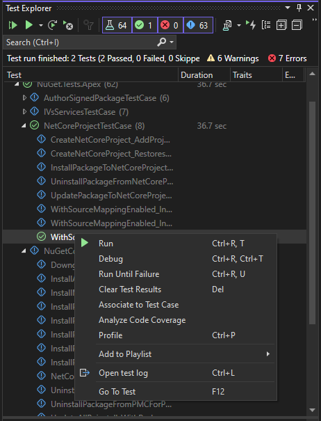
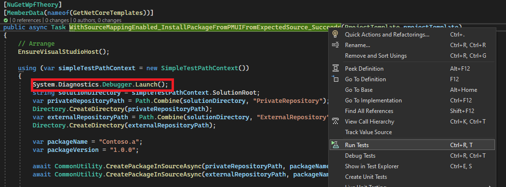

# NuGet.Client Apex Tests

This is a collection of end to end Visual Studio tests built on top of the Apex framework.
All the tests cases are contained within the [NuGet.Tests.Apex](../NuGet.Tests.Apex/NuGet.Tests.Apex.csproj) project. 

Each individual tests starts a runner which will kick off a new Visual Studio process and execute the commands listed.
Due to the fact that each tests starts its own Visual Studio process, these tests are repeatable and are not affected by state left from previous tests unlike the powershell based [End-to-End tests](../../scripts/e2etests/README.md) tests which run in sequence.
In turn that makes these tests really slow, so be very mindful about not duplicating scenarios.

Apex tests call into the NuGet assemblies, and since Visual Studio doesn't have binding redirects for NuGet assemblies, it is best if the VSIX and the Apex tests come from the same build.

## Running Apex tests

### Running Apex tests in Visual Studio

The Apex tests are easiest to run from within the Test Explorer in Visual Studio.



### Running Apex tests on the commandline

To run the tests on the commandline, you first need to start by installing the VSIX you want to test.

cIf you have more than 1 Visual Studio instance and you do not attempt to run from a developer powershell or developer command prompt, you need to set an environment variable to point Apex to the Visual Studio instance you want it to use.

```powershell
    $env:VisualStudio.InstallationUnderTest.Path="C:\Program Files (x86)\Microsoft Visual Studio\2022\Preview"
```

The below runs all the Apex tests:

```cli
msbuild .\build\build.proj /t:ApexTestsStandalone
```

Running all the Apex tests with `dotnet test` currently does not work.
It is very likely that we are not configuring everything correctly. Should that change, this doc will be updated with that guidance.

To run a specific test from the commandline, run:

```cli
 dotnet test .\test\NuGet.Tests.Apex\NuGet.Tests.Apex\bin\Debug\NuGet.Tests.Apex.dll --filter NuGet.Tests.Apex.NuGetConsoleTestCase.MyTestCase
 ```

## Debugging Apex tests

When thinking about debugging Apex tests, there are 2 parts:

- Debugging the test code
- Debugging the Visual Studio instance under test.

### Debugging Apex tests in Visual Studio

Start by adding a `Debugger.Launch();` from within the test case prior to running it.



When running the test, you'll get a prompt for attaching the debugger.

- If you want to debug the test code, attach the debugger to the Visual Studio from which you kicked off the test.
- If you want to debug the Visual Studio instance under test, choose the option to launch a new debugger.
    1. Debug the test until the apex process has started .
    1. Attach the debugger of the your working instance of Visual Studio to the instance with the solution created in the test case.
    1. Set breakpoints in your Visual Studio instance.
    1. Continue the execution of the paused test.
